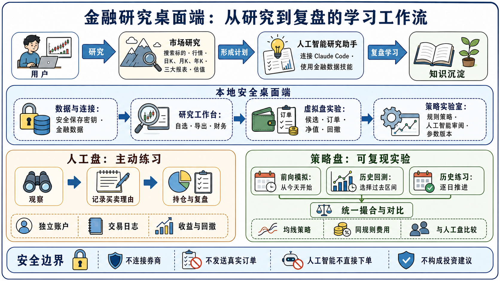

# Finance Desk

一个面向金融数据研究的轻量桌面端：搜索标的、查看最新行情、历史 K 线与财务报表，并在本机保留自选列表。数据由[同花顺金融数据服务](https://fuyao.aicubes.cn/)（`Financial-API` 仓库的 REST 契约）提供。

## 功能

- 名称/代码搜索与标准 `thscode` 消歧，可按资产类型过滤；
- A 股：最新行情快照、近一年前复权日 K、利润表/资产负债表/现金流量表/财务指标；
- 指数：行情快照、成分股、近一年日 K（无复权概念）；
- 基金：基本资料、区间收益、净值走势（场外/REITs）与场内行情及日 K（ETF/LOF）；
- 本机自选列表：跨资产类型批量行情概览、一键打开、移除；
- 数据导出：当前结果可导出为 CSV / JSON（由主进程弹保存框落盘）；
- 本地数据：可选检测 `hithink-finance` CLI，对本地 DuckDB 执行只读 SQL 查询；
- AI 研究助手：把当前标的的已展示行情与研究摘要（不含 Finance Desk API Key）交给新的 Claude Code 终端会话，并让已安装的 `hithink-finance` Skill 继续查证、分析或生成报告；
- API Key 通过系统安全存储（`safeStorage`）加密保存在主进程，渲染层不接触 Key。

它是信息查询、学习与本地模拟工具，不支持真实交易，也不构成投资建议。

## 产品流程图



图中概括了研究工作台、人工智能研究助手、人工盘、策略盘、历史回测、历史练习与安全边界之间的关系。

## 模拟盘、策略与运行模式

模拟盘采用“账户、策略、运行模式”三层分离：人工盘和策略盘独立记账；策略负责产生信号；运行模式决定数据时间如何推进。详见 [产品架构](docs/ARCHITECTURE.md)。

| 功能 | 用途 | 现在可用 |
| --- | --- | --- |
| 人工盘 | 以参考价手动模拟买卖，记录理由、持仓、成交额、净值、收益和回撤 | 是 |
| 策略前向模拟 | 用当前可见行情与历史日线运行内置 MA 策略一次 | 是 |
| 策略历史回测 | 选择过去日期区间，程序逐日运行均线策略并保存摘要 | 是 |
| 人工历史练习 | 从过去日期开始，手动推进交易日；后续价格不显示 | 是 |
| 自定义代码策略 | 受控脚本/JSON 信号适配器 | 接口已设计，执行器待实现 |

人工盘与策略盘共享候选、参考价口径和默认 0.03% 模拟费率，但资金、订单、持仓、净值、回撤均独立。当前没有实现 T+1、涨跌停、停牌、滑点、限价单或真实券商接入。

### 模拟盘使用方式

1. 在“市场研究”查询 A 股，点击“加入虚拟盘候选”。
2. 在“虚拟盘实验”中选择运行模式与日期区间。
3. 人工盘：选择标的和数量，填写交易理由后提交。
4. 前向策略盘：设置短/长均线和目标仓位，点击“同步行情并前向运行”。
5. 历史回测：选择“策略历史回测”，设定过去区间后运行同一个策略。
6. 历史练习：选择“人工历史练习”，点击“应用模式”，再逐日推进。

回测使用当日收盘价作为简化模拟成交价，仅用于学习与比较，不代表真实可成交收益。财报、估值与公司行动在严谨回测中还必须按公告日期/可得时间处理；当前内置均线策略只读取价格日线。

### AI 与自定义策略

“交给 AI 审阅策略与双账户差异”只向 Claude Code 传递脱敏的策略参数、账户指标和研究上下文；AI 不会直接下单。未来自定义策略必须通过标准 JSON 信号进入统一撮合层，不能直接执行任意 Electron 页面代码。接口与安全要求见 [策略接入规范](docs/STRATEGY_API.md)，示例见 [均线策略定义](examples/ma-cross.strategy.json)。

## 环境与启动

需要 Node.js 20+：

```bash
npm install
npm start
```

首次打开后，在“连接设置”中粘贴从 <https://fuyao.aicubes.cn/admin> 创建的 API Key。

## AI 研究助手（Claude Code）

前提：已安装、登录 Claude Code，并已在 Claude Code 中安装 `hithink-finance` Skill。打开任一标的的研究结果后，点击标题右侧的“AI 研究助手”。应用会：

1. 将当前页面已加载的标的、行情与有限财务/基金/成分股摘要写入应用数据目录的研究简报；
2. 在 macOS Terminal 打开**新的** Claude Code 会话，并要求其先读取该简报；
3. 让 Claude Code 使用已安装的 `hithink-finance` Skill 补充、核验和分析数据。

Finance Desk 的 API Key 不会写入简报、命令行参数或 Claude Code 会话。Claude Code 使用其自身的登录状态与 Skill 配置。当前入口只支持 macOS Terminal；它创建新会话，不连接或控制已有 Claude 会话。

关于 Key 同步、Skill 维护、本地 DuckDB 与可复现研究策略的完整流程，请阅读 [CLAUDE_HITHINK_OPERATIONS.md](CLAUDE_HITHINK_OPERATIONS.md)。

### 中国大陆网络

Electron 二进制默认从 GitHub 下载，直连通常不可达。本项目已内置 `.npmrc` 使用 npmmirror 镜像，`npm install` 会自动走镜像；若仍失败，可显式指定：

```bash
ELECTRON_MIRROR=https://npmmirror.com/mirrors/electron/ npm install
```

## 脚本

| 命令 | 用途 |
| --- | --- |
| `npm start` | 启动应用 |
| `npm test` | 运行单元测试（Node 内置 test runner） |
| `npm run lint` | ESLint 检查 |
| `npm run format` / `format:check` | Prettier 格式化 / 校验 |
| `npm run verify` | lint + test |
| `npm run dist` / `dist:dir` | electron-builder 打包 / 解包构建 |

构建产物（Apple Silicon）位于 `release/mac-arm64/Finance Desk.app`。构建首次下载 Electron 时需要网络；若 `npmmirror.com` 解析失败，请检查网络后重试。

## 项目目录

```text
finance-desk/
├── docs/                  产品架构、策略接口与安全边界
├── examples/              策略定义示例
├── src/
│   ├── api.js             HiThink 数据 API 客户端
│   ├── chart.js           日/月/年 K 聚合
│   ├── format.js          格式化纯函数
│   └── paper.js           账户、策略、回测与练习账本
├── tests/                 Node 单元测试
├── main.js                主进程：Key、API、受控 IPC
├── preload.js             渲染层白名单 API
├── renderer.js            UI 交互与模拟盘运行器
├── index.html             页面结构
└── styles.css             页面样式
```

## 安全与隐私

- API Key 只由主进程读取和使用，通过 Electron `safeStorage` 加密后写入用户数据目录（权限 `0600`）；系统安全存储不可用时会显式警告。
- 渲染层启用 `contextIsolation`、`sandbox`、`nodeIntegration: false`，只暴露白名单 IPC 方法，不暴露 `ipcRenderer`/`require`/`process`。
- 外链统一交给系统浏览器打开，主窗口禁止导航到外部站点。
- Key 不出现在 UI、终端、日志或导出文件中。

## 数据来源与风险

- 数据来源：同花顺金融数据服务 REST API（`https://fuyao.aicubes.cn/api`）。
- 行情为最新可用快照，非逐笔实时；历史 K 线为前复权口径；财报空值表示未披露，不补零。
- 本应用仅用于研究与信息查询，不构成投资建议。
